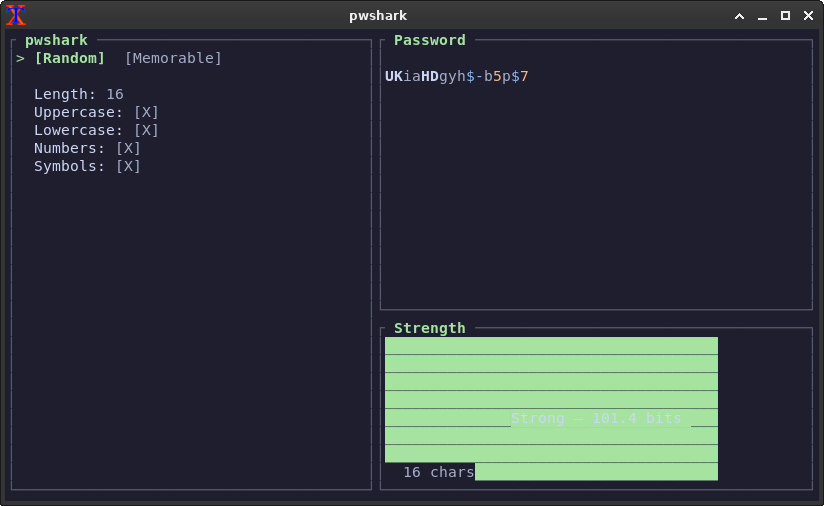

# pwshark 🦈

NIST-compliant password generator. btop-style TUI. Offline. Lightning fast.



## Features

- **Two modes** — Random (charset-based) and Memorable (word-based passphrases)
- **NIST SP 800-90A** — CSPRNG for all random values
- **NIST SP 800-63B** — 8–64 char range, no forced composition rules
- **Word truncation** — keeps first vowel + consonants ≤5 chars (e.g. "seemingly" → "semln")
- **EFF large diceware** — 7,776 word list embedded in binary
- **Entropy gauge** — Shannon entropy in bits with strength label
- **Color-coded output** — uppercase bright, lowercase dim, numbers orange, symbols blue
- **Clipboard auto-clear** — copies and clears after 15 seconds
- **Pipe mode** — `--stdout` for scripting
- **Responsive layout** — two-column on wide terminals, single-column on narrow
- **Memory-safe** — passwords zeroed on drop via Zeroize
- **Single binary** — no runtime dependencies, word list compiled in

## Install

### One-line (Linux/macOS)

```bash
curl -fsSL https://raw.githubusercontent.com/antirubber/pwshark/main/install.sh | bash
```

This installs Rust (via rustup) if needed, clones the repo, builds a release binary, and symlinks it to `~/.local/bin/pwshark`.

### From source

```bash
# Prerequisites: Rust toolchain (https://rustup.rs)
git clone https://github.com/antirubber/pwshark.git
cd pwshark
cargo build --release
sudo cp target/release/pwshark /usr/local/bin/
```

### Dependencies

| What | Why | Installed by |
|------|-----|-------------|
| Rust | Compile from source | rustup |
| x11/xcb libs | Clipboard support (arboard) | system packages |
| libxcb, libx11-dev | Clipboard on Linux | `apt install libxcb1-dev libx11-dev` |

> **Note:** On Debian/Ubuntu, install clipboard deps first:
> ```bash
> sudo apt install libxcb1-dev libx11-dev libxkbcommon-dev
> ```

## Usage

### TUI mode

```bash
pwshark
```

| Key | Action |
|-----|--------|
| `Tab` | Switch Random / Memorable mode |
| `↑↓` | Move between options |
| `←→` | Adjust value or toggle option |
| `Enter` | Generate new password |
| `y` | Copy to clipboard (auto-clears in 15s) |
| `q` | Quit |

### Pipe mode

```bash
# Random password (16 chars, default)
pwshark --stdout

# Memorable passphrase (4 words, truncated, capitalized, with numbers)
pwshark --stdout --mode memorable

# Custom: 8 words, dot separator, no truncate
pwshark --stdout --mode memorable --words 8 --separator . --no-truncate

# Random 32-char, no symbols
pwshark --stdout --length 32 --no-symbols

# Copy directly to clipboard (Linux)
pwshark --stdout | xclip -selection clipboard
```

### All flags

```
--stdout                 Output raw password to stdout (no TUI)
--mode <MODE>            random | memorable [default: random]
--length <N>             Password length, random mode [default: 16]
--words <N>              Word count, memorable mode [default: 4]
--separator <CHAR>       Word separator [default: -]
--uppercase              Include uppercase (default: on)
--lowercase              Include lowercase (default: on)
--numbers                Include numbers (default: on)
--symbols                Include symbols (default: on)
--capitalize             Random capitalization, memorable mode (default: on)
--add-numbers            Add random numbers, memorable mode (default: on)
--truncate               Truncate words ≤5 chars (default: on)
--no-uppercase           Disable uppercase
--no-lowercase           Disable lowercase
--no-numbers             Disable numbers
--no-symbols             Disable symbols
--no-capitalize          Disable random capitalization
--no-add-numbers         Disable random numbers
--no-truncate            Disable word truncation
```

## Defaults

**Random mode:** length 16, uppercase on, lowercase on, numbers on, symbols on.

**Memorable mode:** 4 words, `-` separator, random capitalize on, add numbers on, truncate on.

Auto-generates on launch.

## Building

```bash
cargo build --release
```

Produces `target/release/pwshark` (~2MB static binary).

## License

MIT
